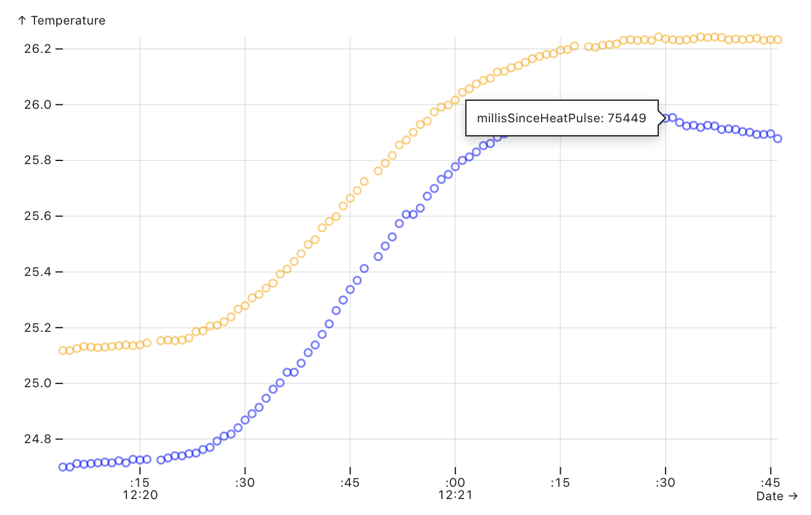
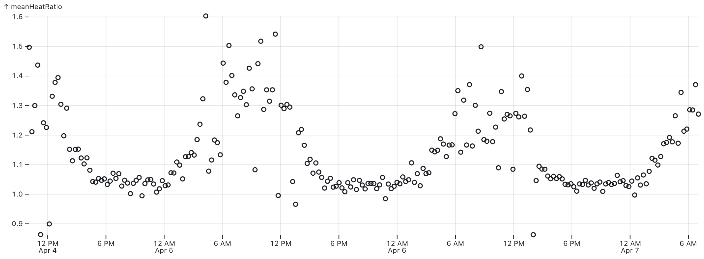

# Sapflow

Exploratory dashboard

## Attach data

Attach one or more `datalog.csv` files from the sapflow datalogger. Note: `datalog.csv` files should contain at least the following columns:

- temp1
- temp2
- millisSinceHeatPulse
- rtcUnixTimestamp
- millisSinceReferenceTemp
- nodeId

```js
const csvfile = view(
  Inputs.file({
    label: 'CSV file(s)',
    accept: '.csv',
    required: true,
    multiple: true,
  })
);
```

```js
const all_data = await Promise.all(
  csvfile.map((datalog) => datalog.csv({ typed: true }))
);
const input_data = all_data.flat();
```

## Exploring the raw data

First, let's take a look at the raw data:

### Data table

```js
view(Inputs.table(input_data));
```

Total rows in attached data file(s): ${input_data.length}.

Let's limit the number of data points rendered to zoom in on a single heat pulse:

```js
const data_index_start = view(
  Inputs.number({ label: 'Data index start', value: '1200' })
);
```

```js
const data_index_end = view(
  Inputs.number({ label: 'Data index end', value: '1300' })
);
```

Modify the inputs above to change start/end indices.

Currently showing data rows at index ${data_index_start} through ${data_index_end}. Our goal is to identify when both temperature sensors are declining in temperature.

```js
display(
  Plot.plot({
    x: {
      grid: true,
      label: 'Date',
    },
    y: {
      grid: true,
      label: 'Temperature',
    },
    marks: [
      Plot.dot(input_data.slice(data_index_start, data_index_end), {
        x: (d) => new Date(d.rtcUnixTimestamp * 1000),
        y: 'temp1',
        stroke: 'blue',
        opacity: 0.5,
        tip: true,
        title: (d) => `millisSinceHeatPulse: ${d.millisSinceHeatPulse}`,
      }),
      Plot.dot(input_data.slice(data_index_start, data_index_end), {
        x: (d) => new Date(d.rtcUnixTimestamp * 1000),
        y: 'temp2',
        stroke: 'orange',
        opacity: 0.5,
        tip: true,
      }),
    ],
  })
);
```

<details>
  <summary>Example (click to expand)</summary>
  <p>Below, you can see that the temperature readings for both temperature sensors begin to decline at around 75000 milliseconds after the heat pulse has fired.</p>
  
</details>

## Converting raw temperature data to mean heat ratios

```js
const hr_window_start = view(
  Inputs.range([0, 100000], {
    label: 'Heat ratio window start',
    value: '75000',
    step: '1',
  })
);
```

```js
const hr_window_end = view(
  Inputs.range([0, 100000], {
    label: 'Heat ratio window end',
    value: '95000',
    step: '1',
  })
);
```

```js
const invert_heat_ratios = view(
  Inputs.toggle({ label: 'Invert heat ratios', value: true })
);
```

```js
const calculatedHeatRatios = getHeatRatios(
  input_data,
  {
    id: (d) => d.nodeId,
    timestamp: (d) => d.rtcUnixTimestamp,
  },
  { heatRatioWindowStart: hr_window_start, heatRatioWindowEnd: hr_window_end }
);
```

```js
const combinedHeatRatioData = [
  ...Object.values(calculatedHeatRatios.data),
].flat();
```

```js
display(
  Plot.plot({
    x: {
      grid: true,
    },
    y: {
      grid: true,
    },
    width,
    marginRight: 150,
    marks: [
      Plot.dot(
        combinedHeatRatioData.map((d) => ({
          ...d,
          meanHeatRatio: invert_heat_ratios
            ? 1 / d.meanHeatRatio
            : d.meanHeatRatio,
        })),
        {
          x: 'date',
          y: 'meanHeatRatio',
          fy: 'nodeID',
          tip: true,
        }
      ),
    ],
  })
);
```

<details>
  <summary>Example (click to expand)</summary>
  <p>Given a few days' worth of data, you should be able to see a diurnal pattern where the mean heat ratio values are:</p>
  <ul>
    <li>close to 1.0 during nighttime, when little/no transpiration takes place;</li>
    <li>increase after sunrise, peaking at around mid-day; and</li>
    <li>fall after sunset.</li>
  </ul>
  
  <p>You might need to invert the values in case the sapflow sensors were installed such that the downstream and upstream sensors were flipped.</p>
</details>

### Data table

```js
view(Inputs.table(combinedHeatRatioData));
```

```js
/**
 * Returns heat ratios from raw data. Returned object is in the shape of:
 * {
 *   ids: [id1, id2, ...],
 *   data: {
 *     id1: [
 *       { ... heatRatioData ... }
 *     ],
 *     id2: [
 *       { ... heatRatioData ... }
 *     ]
 *   }
 * }
 *
 * @param {[Object]} csvData array of objects, where each object is a csv row
 * @example
 * [
 *   {
 *     temp1: 22.3,
 *     temp2: 22.2,
 *     millisSinceReferenceTemp: 11000,
 *     millisSinceHeatPulse: 1000,
 *     nodeId: 1,
 *     timestamp: 15729102344
 *   },
 *   {
 *     ...
 *   }
 * ]
 * @param {Object} options accessor functions and filters
 */
function getHeatRatios(csvData, options = {}, constants = {}) {
  const { heatRatioWindowStart = 55000, heatRatioWindowEnd = 75000 } =
    constants;

  const {
    downstreamTemperatureSensor = (d) => +d.temp2,
    upstreamTemperatureSensor = (d) => +d.temp1,
    referenceTimer = (d) => +d.millisSinceReferenceTemp,
    heatPulseTimer = (d) => +d.millisSinceHeatPulse,
    timestamp = (d) => +d.unix_timestamp, // expects unix timestamps in seconds
    id = (d) => d.nodeID,
    downstreamTempDifference = (d) => +d.downstreamTempDifference,
    upstreamTempDifference = (d) => +d.upstreamTempDifference,
    filters = {
      temperature: (datum) =>
        upstreamTemperatureSensor(datum) >= 0 &&
        downstreamTemperatureSensor(datum) >= 0 &&
        Math.abs(upstreamTemperatureSensor(datum)) < 40 &&
        Math.abs(downstreamTemperatureSensor(datum)),
      heatRatioCalculation: (datum) =>
        referenceTimer(datum) > 10000 &&
        heatPulseTimer(datum) > heatRatioWindowStart &&
        heatPulseTimer(datum) < heatRatioWindowEnd &&
        // make sure the temperature hasn't dropped back down to the baseline reference temp
        downstreamTempDifference(datum) > 0 &&
        upstreamTempDifference(datum) > 0,
    },
  } = options;

  csvData.sort((a, b) => {
    if (timestamp(+a) > timestamp(+b)) return 1;
    if (timestamp(+a) < timestamp(+b)) return -1;
    if (heatPulseTimer(+a) > heatPulseTimer(+b)) return 1;
    if (heatPulseTimer(+a) < heatPulseTimer(+b)) return -1;
  });

  const dataGroupedById = csvData
    .filter(filters.temperature)
    .reduce((acc, curr) => {
      const rowToAdd = { ...curr, date: new Date(timestamp(curr) * 1000) };

      if (!acc[id(curr)]) {
        acc[id(curr)] = [rowToAdd];
      } else {
        acc[id(curr)].push(rowToAdd);
      }

      return acc;
    }, {});

  const ids = Object.keys(dataGroupedById);

  const dataGroupedByHeatPulse = Object.fromEntries(
    Object.entries(dataGroupedById).map(([id, rawData]) => {
      let indexOfCurrentHeatPulse = 0;
      let dataBinnedByHeatPulse = [];

      for (let [index, datum] of rawData.entries()) {
        if (index === 0) {
          dataBinnedByHeatPulse[0] = [datum];
        }

        const prevIndex = index - 1;

        if (prevIndex > 0) {
          // Conditions for determining a new heat pulse bucket should be created:
          // - if the millisSinceHeatPulse of the current datum is less than the millisSinceHeatPulse of the
          // previous datum
          // - if there was a data interruption (i.e., the unix_timestamp of the current datum is >3 seconds
          // apart from the unix_timestamp of the previous datum), count these as distinct heat pulse buckets
          if (referenceTimer(datum) < referenceTimer(rawData[prevIndex])) {
            indexOfCurrentHeatPulse++;
            dataBinnedByHeatPulse[indexOfCurrentHeatPulse] = [datum];
          } else {
            dataBinnedByHeatPulse[indexOfCurrentHeatPulse].push(datum);
          }
        }
      }

      dataBinnedByHeatPulse = dataBinnedByHeatPulse.map((heatPulseData) => {
        const referenceTempData = heatPulseData.filter(
          (datum) => referenceTimer(datum) < 10000
        );

        const referenceDownstreamTemp = getMean(
          referenceTempData.map((datum) => downstreamTemperatureSensor(datum))
        );

        const referenceUpstreamTemp = getMean(
          referenceTempData.map((datum) => upstreamTemperatureSensor(datum))
        );

        return heatPulseData.map((datum) => {
          const downstreamTempDifference =
            downstreamTemperatureSensor(datum) - referenceDownstreamTemp;
          const upstreamTempDifference =
            upstreamTemperatureSensor(datum) - referenceUpstreamTemp;
          const heatRatio = downstreamTempDifference / upstreamTempDifference;
          return {
            ...datum,
            referenceDownstreamTemp,
            downstreamTempDifference,
            referenceUpstreamTemp,
            upstreamTempDifference,
            heatRatio,
            referenceTempData,
          };
        });
      });

      return [id, dataBinnedByHeatPulse];
    })
  );

  const meanHeatRatiosGroupedById = Object.fromEntries(
    Object.entries(dataGroupedByHeatPulse).map(([nodeId, heatPulses]) => {
      const meanHeatRatios = heatPulses.map((heatPulseData) => {
        const timestampForMeanHeatRatio =
          timestamp(heatPulseData[0]) -
          Math.round(referenceTimer(heatPulseData[0]) / 1000 + 10);
        const nodeID = id(heatPulseData[0]);
        const date = new Date(timestampForMeanHeatRatio * 1000);
        const heatPulseDataUsedForCalculatingHr = heatPulseData.filter(
          filters.heatRatioCalculation
        );
        const meanHeatRatio = getMean(
          heatPulseDataUsedForCalculatingHr.map((datum) => datum.heatRatio)
        );

        return {
          date,
          nodeID,
          unixTimestamp: timestampForMeanHeatRatio,
          meanHeatRatio,
          // heatPulseDataUsedForCalculatingHr,
          // heatPulseData
        };
      });

      return [nodeId, meanHeatRatios];
    })
  );

  return {
    ids,
    data: meanHeatRatiosGroupedById,
  };
}

function getMean(numbers) {
  if (!Array.isArray(numbers)) {
    numbers = Array.from(arguments);
  }

  if (!numbers.length) {
    return undefined;
  }

  return numbers.reduce((acc, curr) => +acc + +curr, []) / numbers.length;
}
```
